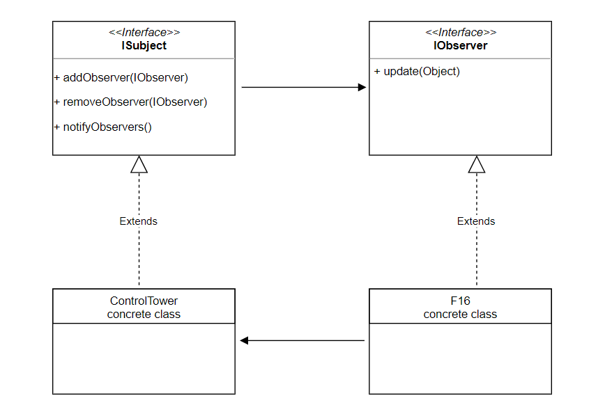

## What is it?

The pattern is formally defined as a one to many dependency between objects so that when one object changes state all the dependents are notified.
Tôi (Observer) follow 1 fb page FP (Subject). Khi FP có thay đổi (new post,..) thì Tôi (Observer) sẽ nhận được thông báo.
Observer-Subjects : 1-Many Relationship

## Example

ví dụ:

- Máy bay đang bay muốn nhận thông tin từ trạm không lưu, subscribe lúc cất cánh và unsubscribe lúc hạ cánh
- Frontend frameworks often involve the publisher-subscriber model, where a change in a DOM element on the webpage by a user causes a data-structure held in the browser's memory (think javascript code) gets updated. AngularJS and KnockoutJS frameworks are examples of this pattern.
- In Java, implementations of java.util.EventListener are examples of the observer pattern.

## Caveats

In case of many subjects and few observers, if each subject stores its observers separately, it'll increase the storage costs as some subjects will be storing the same observer multiple times.

A small change in the subject, may lead to a cascade of updates for the observers and their dependent objects. If clients invoke notify on the subject after each change, it can overwhelm the observers with updates, whereas another option can be to batch the changes and then invoke notify on the subject.

Usually, another entity Change Manager can sit between the observers and the subject in case there are complex dependencies between the subject and the observers.
