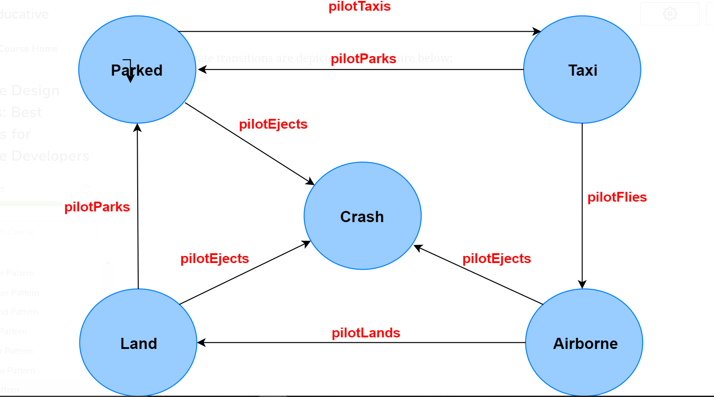

## What is it?

The state pattern will be reminiscent of automata class from your undergraduate degree as it involves state transitions for an object. The state pattern encapsulates the various states a machine can be in. The machine or the context, as it is called in pattern-speak, can have actions taken on it that propel it into different states. Without the use of the pattern, the code becomes inflexible and littered with if-else conditionals.

Formally, the pattern is defined as **allowing an object to alter behavior when its internal state changes so that it appears to change its class.**

## Example

- javax.faces.lifecycle.LifeCycle.execute() method is dependent on current state of JSF lifecycle.

## Caveats

In our example, the F-16 object is assumed to be in parked state when new-ed up however a client can configure the context with a state at instantiation time if the context can be in more than one states when new-ed up. But once configured, the clients don't deal with context states again.

If the state types only contain behavior and no data then their instances can be expressed as flyweight objects and shared amongst multiple context objects. In our example the ParkedState only contains methods and no data particular to an object of F16. This allows us to have multiple F16 objects use the same parked state object to be in the parked state.
