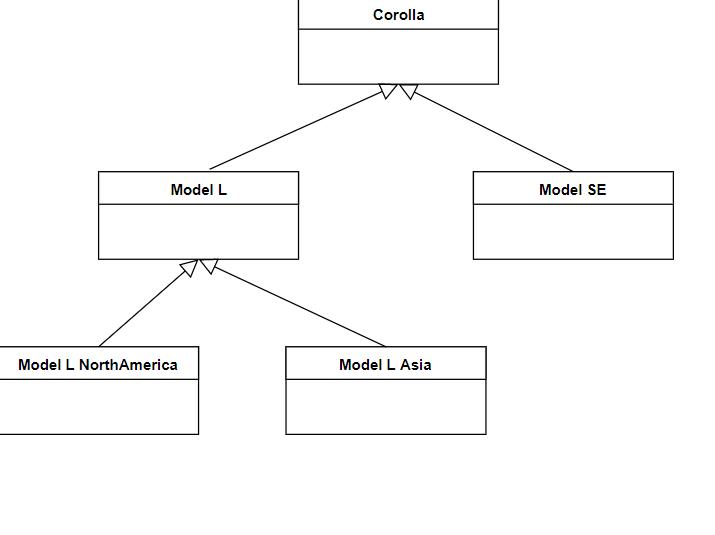
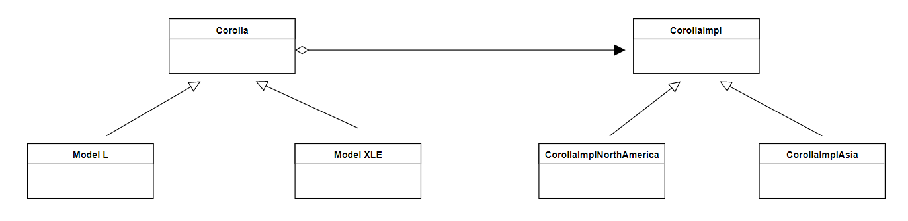

## What is it?

Một mẫu xe tên Name có nhiều loại L, X, Z. Triển khai mẫu xe này ở mỗi quốc gia cũng có các tiêu chuẩn riêng và sinh ra các loại như Name_L_VN, Name_X_Japan..
Do đó, đây là tình huống chúng ta cần chia ra implement chúng thành 2 class: 1 để biểu diễn itself và 1 để biểu diễn hành động của chúng what it does (ví dụ tiêu chuẩn khác nhau theo mỗi quốc gia, nên hành vi cũng khác),

the bridge pattern **lets you vary the abstraction independently of the implementation, thus decoupling the two in the process.** However, the abstraction and the implementation in the definition don't mean Java's abstract class/interface and concrete classes respectively.

## Example

without bridge pattern

with bridge pattern
