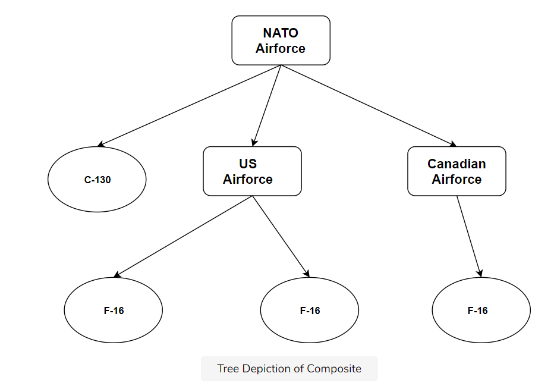

## What is it?

the composite pattern is defined as **composing objects into tree structures to represent part-whole hierarchies, thus letting clients uniformly treat individual objects and composition of objects.**

The pattern allows the clients to ignore the differences between the whole and the part.

## Example

Assume, that we now want to represent all the aircraft in the combined air forces of the NATO alliance. An air force is primarily made up of several aircraft but it can also have sub-air forces. For instance, the US has the 1st Air Force, 2nd Air Force so on and so forth. Our NATO alliance can consist of air forces from multiple countries including individual planes.

If we want to treat the composite and each part as the same, we would need both the part (the aircraft) and the whole (the airforce) to implement the same interface. In our scenario we'll create three classes:

Airforce
F16
C130Hercules

## Caveats

- references to parents: Since the composite is a tree structure, one may or may not need to store references to the parent.

- ordering of children in a composite: In some scenarios, it might be required to store or traverse the children in a certain order within the composite.

- cacheing part of the composite for traversal: For complex composites, it may make sense to cache part of the composite object to speed up traversal or search.
